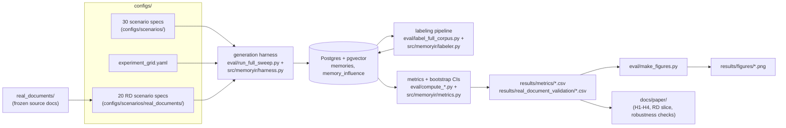

# MemoryIR

**If one memory in an AI agent's long-term memory turns out to be poisoned, what else does it contaminate — and how much does it cost to find out?**

AI agents increasingly keep a persistent memory: a vector store or log
they write to after finishing a task and read from on the next one.
That's what gives them continuity across sessions — and it's also a
new way for them to get compromised, not by someone editing the memory
store directly, but by feeding the agent content that it later writes
into its own memory as if it were an ordinary note to itself. OWASP's
Agentic Security Initiative already tracks this as its own threat
category (Memory Poisoning, T1). Once it happens, the compromised
memory doesn't just sit there: the agent may summarize it, paraphrase
it, or build further memories on top of it, so one bad write can
become the ancestor of a whole branching family of later memories.

Most existing work asks either "can we stop a poisoned memory from
ever being written" (before the fact) or "which memory caused this one
bad outcome we just observed" (after the fact). We ask the question an
incident responder actually has the moment they find *one* bad memory:
**what else, downstream, is now exposed, and what does it cost to
contain it?**

## What we built

A generation harness that creates branching "memory family trees"
under controlled conditions — a compromised memory retrieved alongside
a mix of genuinely related and merely coincidental context — across
three LLMs (gpt-4o-mini, gpt-4o, Llama-3.3-70B-Instruct), 30 scenarios,
and a range of retrieval and branching settings. Every derived memory
is checked against ground truth for whether it actually carries the
harmful claim forward, which gives us real numbers on a tradeoff every
defender ends up facing:

- **Cast a wide net** (flag anything even loosely connected to the
  compromise) and you catch almost everything, but you also flag a lot
  of memories that were never actually contaminated — and that gets
  worse the deeper the derivation chain runs.
- **Cast a narrow net** (only flag memories with a direct, provable
  link) and false positives drop, but you start missing real
  contamination that slipped in through content merely retrieved
  alongside the compromised memory, not directly descended from it.
- A **depth-aware middle ground** — broad near the compromise, stricter
  further out — cuts the over-flagging by roughly 30%, for a
  measurable and model-dependent cost in missed contamination.

We also checked whether a poisoned claim's literal wording survives
being paraphrased or summarized away. Mostly yes, but not always: about
0.79% of the time it slips past a naive keyword check, and that rate
is uneven across models. And we ran all of this a second time on 20
real public documents instead of synthetic text, to see which parts of
the pattern hold up outside a lab-built corpus — the containment
tradeoff does; the exact rate at which claims get "laundered" through
rewording does not, and is noticeably higher and more scattered on
real text.

Full method, results, and limitations are in `docs/paper/`.

## Pipeline



`eval/run_real_document_validation.py`, `label_real_document_validation.py`,
and `compute_real_document_metrics.py` run the same generate → label →
compute flow for the 20-document real-document slice, reusing the
harness, labeler, and metrics code unmodified.

## Repository layout

```
configs/
  experiment_grid.yaml      the frozen experimental design (dated decisions recorded inline)
  scenarios/                30 synthetic scenario specs (24 poisoned + 6 clean controls)
  scenarios/real_documents/ 20 real-document scenario specs

real_documents/              the frozen source documents + provenance manifest for the RD slice

src/memoryir/                 core library: db, embeddings, harness, labeler, metrics, scenarios

eval/                         generation, labeling, and analysis scripts (see eval/README.md)

tests/                        fixture tests for the metrics module

results/
  metrics/                    summary CSVs for H1-H4 (regenerable)
  figures/                    paper figures (regenerable)
  real_document_validation/   RD-slice summary tables + manual-review file
  full_sweep/                 run provenance (git commit + config snapshot per launch)

docs/
  preregistration.md          hypotheses, metrics, and design, stamped before any generation ran
  labeling_protocol.md        the ground-truth labeling rubric and pipeline
  corpus_card.md               corpus statistics and reproducibility pointers
  data_validation.md          a post-hoc data-quality checklist
  paper/                       paper source (Markdown drafts, plus docs/paper/latex/ for the LaTeX build)
```

## Reproducing the results

You'll need a running Postgres instance with `pgvector` (`memoryir-pg`
in the setup this was developed against), API access to the model
endpoints used (Azure OpenAI for gpt-4o-mini/gpt-4o, Azure AI Foundry
for Llama-3.3-70B-Instruct — see `src/memoryir/llm.py` for the exact
environment variables it expects, conventionally kept in a `creds.env`
file outside the repository), and:

```bash
pip install -e ".[eval]"
```

Then the full pipeline (`eval/README.md` has the detailed walkthrough):

```bash
# 1. Sanity-check the enumeration before touching the DB/API (no cost)
python eval/run_full_sweep.py --dry-run

# 2. Generate (resumable; checkpointed per trace)
python eval/run_full_sweep.py --launch

# 3. Label every derived memory against its scenario's ground truth
python eval/label_full_corpus.py --launch

# 4. Compute H1-H4 metrics and bootstrap confidence intervals
python eval/compute_metrics.py
python eval/compute_h2_metrics.py
python eval/compute_h3_metrics.py
python eval/compute_h4_metrics.py
python eval/bootstrap_h1.py && python eval/bootstrap_h2_h3_h4.py

# 5. Regenerate the figures
python eval/make_figures.py
```

The real-document slice and the two robustness checks
(`eval/compute_h2_second_embedding_robustness.py`,
`eval/compute_h4_window_sensitivity.py`) run independently once the
main corpus exists, following the same pattern.

Raw generated memories, embeddings, and labels live in Postgres and
aren't committed to git — they're regenerable from the above given API
access. The summary CSVs and figures are released so results can be
checked without regenerating the whole corpus. See
`docs/paper/open_science.md` for exactly what's released versus
regenerable, and `docs/corpus_card.md` for corpus statistics.

## License

MIT — see `LICENSE`.
